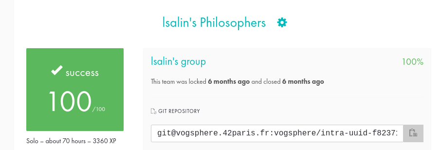

# Philosophers

🇫🇷

L'objectif du projet "Philosophers" est de se familiariser avec les concepts de threading et de processus en utilisant le langage C.
Ce projet introduit aux notions de __threads__, de __mutexes__ et de __mémoire partagée__ entre processus.

Le défi est de simuler un scénario où plusieurs philosophes sont assis autour d'une table, en alternant entre manger, dormir et penser.

Chaque philosophe a besoin de deux fourchettes pour manger, mais il y a autant de fourchettes que de philosophes.

L'objectif est de garantir que chaque philosophe puisse manger sans mourir de faim, tout en évitant les problèmes d'interblocage et de famine.

Les philosophes ne peuvent pas communiquer entre eux et la simulation prend fin si un philosophe meurt de faim ou si tous les philosophes ont mangé un certain nombre de fois.

